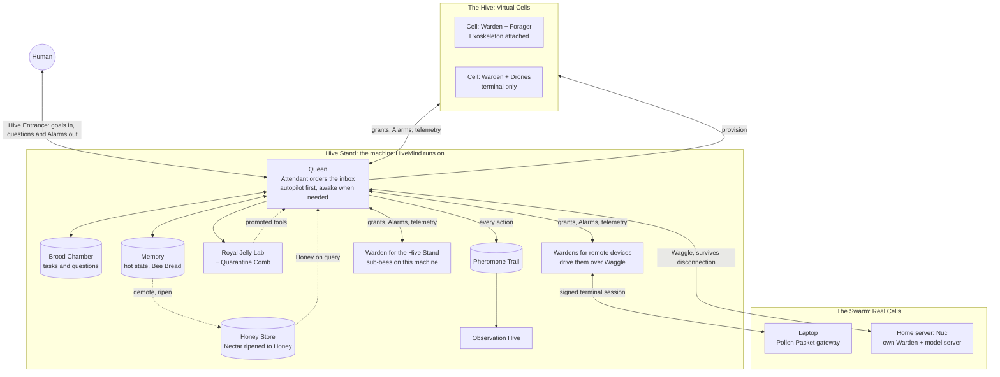

  

**A super-agent orchestrator that puts real devices and spun-up virtual machines under one roof, equips either with full virtual peripherals when a task calls for it, delegates work to supervised subagents, builds its own tools, keeps its knowledge outside any one context window, and runs it all from one central brain that behaves like an operating system.**

> Status: early-stage / architecture & design phase. Nothing here is stable yet; this README describes the target system. The build order lives in [`.claude/roadmap.md`](.claude/roadmap.md) and the code standard in [`.claude/codingrules.md`](.claude/codingrules.md).

---

## Vision

Most agent frameworks run a single model in a single process against a fixed toolset. HiveMind is designed to be the layer above that: a **Queen**, a central orchestrating agent, that can, on its own initiative:

- Provision isolated **Virtual Cells** (VMs/containers) on demand, or hand a task straight to a **Real Cell** (the machine HiveMind runs on, or a device already enrolled in the Swarm) when spinning up new infrastructure would be overkill.
- Drive any Cell, Real or Virtual, the way the task actually needs: a terminal session by default, stepping up to a full **Exoskeleton** (a virtual monitor, keyboard, mouse, and speakers) when the job needs a real desktop or browser session, invisibly and in parallel.
- Put a **Warden** on every Cell: an always-on supervisor that spawns sub-bees, watches them, handles what it can, and escalates what it can't, so the Queen only ever deals with what actually needs her.
- Run as a **kernel**, not a chatbot: a thin always-on loop with an inbox, deterministic **autopilot** for everything routine, and an **awake** LLM episode only for what needs judgement.
- **Write, test, and register new tools for itself** via the Royal Jelly Lab and the Comb Registry instead of being limited to a fixed toolbelt.
- **Connect out to arbitrary devices** (servers, laptops, phones, IoT endpoints) through the Swarm, turning them into Real Cells it can dispatch Workers to, and promoting capable ones to self-sufficient **Nucs**.
- **Remember without bloating**: knowledge lives in tiers, from the hot state a bee needs right now down to a searchable long-term Honey Store, and every bee hands off and resets before its context overflows.
- Coordinate all of the above as one coherent system rather than a pile of scripts.

The end goal is a self-extending, self-orchestrating agent swarm that can be pointed at a broad goal and figure out what compute, tools, and endpoints it needs to get there.

---

## Terminology

The system borrows its vocabulary from real bee biology and beekeeping; it reads better than generic infra terms and every name maps to an actual behavior.

| Term | Meaning |
|---|---|
| **Queen** | The central orchestrator, the only component with a global view of the system. Delegates everything; may change which model runs any bee |
| **Hive Stand** | The machine HiveMind itself runs on: home of the Queen, the first Real Cell, and where every Warden lives by default |
| **The Hive** | The on-demand Virtual Cell fleet |
| **Cell** | A unit of compute a Worker runs in or on: either a Virtual Cell or a Real Cell |
| **Virtual Cell** | A fresh VM/container the Hive provisions on demand and tears down when the task ends |
| **Real Cell** | An existing real device (the Hive Stand, or a device already in the Swarm) borrowed for a task and left exactly as it was found |
| **Colonized** | A pollinated Real Cell the Hive has fully moved into: its Warden (and sub-bees) live on the device itself, not just their hands reaching in over a session, and it carries its own scaffolded tools and Honey. The threshold is Level 1 of the runtime ladder; colonization outlives any one lease |
| **Nuc** | A colonized Real Cell that has also gained its own model server; keeps working when cut off from the Hive Stand |
| **Warden** | The always-on supervisor of one Cell: spawns and watches sub-bees, handles their Alarms, escalates what it can't resolve, never provisions Cells |
| **Worker** (Worker Bee) | A subagent bound to one Cell, spawned and supervised by that Cell's Warden |
| **Forager** | A Worker specialized in outbound data gathering (scraping, search, monitoring) |
| **Scout** | A Worker specialized in recon/exploration of new targets |
| **Guard Bee** | A Worker specialized in security, access control, and monitoring |
| **Undertaker** | A Worker specialized in cleanup: tears down Virtual Cells, releases Real ones |
| **Drone** | A short-lived, general-purpose, fully expendable Worker |
| **House Bee** | A Worker that keeps memory tidy: sweeps stale hot state, ripens Nectar and Bee Bread into Honey |
| **Attendant** | A supervisor's inbox triage. The Queen's orders everything waiting for her, weighting the human heavily but not absolutely; every Warden has a smaller one of its own |
| **Autopilot** | Deterministic handling of an event by rules, with no model call. Every event, at every level, goes here first |
| **Awake** | An LLM episode, run only when autopilot can't decide. Assembled from stored state, then discarded; nothing accumulates |
| **Alarm** | An issue a bee can't resolve, escalated up the chain: sub-bee → Warden → Queen → human. The human is always last |
| **Capping** | The quality gate: work is proposed with its expected outcome, checked, applied, verified, and rolled back if wrong. Uncapped work never leaves scratch |
| **Watch mode** | What a Real Cell's Warden does when no bees are active: observe read-only, and on each **Patrol** review what it saw and report or discard |
| **Access level** | How much of a Real Cell HiveMind may touch: read-only, scratch, or full. Virtual Cells are always full |
| **Forage** | Capacity: cores, memory, GPU, model seats, spend. Cells report it, Wardens hold grants of it, only the Queen divides it |
| **Forage map** | The catalogue of every source that can serve a model, with its grade (strength), distance (latency from a given Cell), abundance (free seats) and cost |
| **Fanner** | The meter every model call passes through: enforces seat counts, queues by tempo, measures speed, and reports usage. Named for the bees that fan to regulate the hive |
| **Royal Reserve** | Forage held back before any grant: what the Queen, the Attendant and the House Bees need, plus headroom |
| **Tempo** | A task's speed-against-accuracy setting: a latency budget and an accuracy bar. Read when choosing models, dividing Forage and deciding how much checking a task gets |
| **Exoskeleton** | The bundle of virtual peripherals a Worker can be equipped with, on demand, on any Cell |
| **Compound Eye** | Virtual display / framebuffer |
| **Antennae** | Virtual keyboard & mouse (synthetic HID input) |
| **Buzz** | Virtual audio (speaker/mic) |
| **Royal Jelly Lab** | The tool-authoring and validation pipeline that feeds the Comb Registry |
| **Comb Registry** | The canonical catalog where promoted tools are versioned, scoped, and discoverable |
| **Quarantine Comb** | The sandbox a new tool must pass through before promotion |
| **Brood Chamber** | The central task/state store |
| **Honey Store** | The persistent, indefinitely-growing knowledge base the Queen shares with Workers: the cold tier of memory |
| **Nectar** | Raw, unprocessed findings a Worker brings back from a task |
| **Bee Bread** | The warm tier of memory: recent results, episodes and Handoffs, looked up by id rather than searched |
| **Honey** | Distilled, indexed knowledge retrieved from the Honey Store on demand |
| **Ripening** | The process of turning Nectar into Honey (chunking, summarizing, embedding, indexing) |
| **Handoff** | The structured document a bee writes before its context is reset, rebound, migrated or paused; the next bee resumes from it |
| **Waggle** (Waggle Protocol) | The Queen ↔ Warden ↔ Worker ↔ Swarm communication protocol. Carries messages between bees; model calls travel separately to whichever provider serves the model |
| **Hive Entrance** | The system's API gateway and the human's inbox: goals in, questions and Alarms out, answers back |
| **The Swarm** | The Real Cell / Device Mesh, external devices registered with the Queen |
| **Pollen Packet** | The thin gateway installed on an external device: enrols it and opens a terminal session for its Warden. No brain of its own |
| **Swarming** | Scaling up, spinning up more Cells/Workers |
| **Absconding** | Mass teardown/shutdown of the Hive |
| **Sting Cut** | Per-Cell emergency disconnect: revoke lease, kill Hive-started processes for that lease, and scrub lease-local traces while preserving central audit |
| **Overwintering** | An idle/paused pool of Virtual Cells kept dormant rather than destroyed |
| **Clustering** | The pause-and-preserve protocol when a model provider is unavailable: checkpoint everyone, hold, resume when it returns |
| **Requeening** | Recovering from a Queen failure / restoring orchestrator state |
| **Pheromone Trail** | The audit/log trail left by system actions, except Night Veil execution records which are not retained |
| **Observation Hive** | The live UI: every bee's thoughts, every Cell, the Forage split, the Attendant views, a chatbox to the Queen, and a browsable Honey tree. Read-only except the chat |
| **Pheromone Mask tactics** | Optional, short-lived behavior overlays normally invoked by a Warden per task segment, or force-applied by the Queen at Cell scope: **Write-Like-Human** (tone and pacing) and **Mouse-Like-Human** (input cadence). These are compatibility tactics for fragile UX flows, not a global mode |
| **Comb Shield level** | A Cell security tier: **Meadow (Tier 0)** default any-machine baseline, **Propolis (Tier 1)** OpenVPN-only hardened baseline (no Tor), **Night Veil (Tier 2)** human-requested virtual-only profile with all web traffic through OpenVPN + Tor, direct egress blocked, Tor Browser available, and local-model-only execution |
| **Honey clearance** | Data sensitivity labels on Nectar/Honey: **Wildflower (C0)** public/non-sensitive, **Apiary (C1)** internal non-personal, **Royal (C2)** personal/sensitive; policy controls what each Cell tier may read or write. Any user personal detail at all, including first name or habits, is Royal |
| **Hive Manifest** | A config/spec file |
| **Propolis** | External plugin/extension packages |
| **Brood** | A release/version (Brood 1.0, Brood 2.0, ...) |

---

## Core Concepts

### 1. The Queen (Central Orchestrator, run like a kernel)
The single always-on brain of the system. It owns the task graph, decides what compute a task gets, divides Forage, assigns work to Wardens, and is the only component with a global view of the Hive. It never does the "hands-on" work itself; it delegates.

Structurally the Queen is a small script that never stops, closer to an operating system than to a chat session:

- **An inbox, ordered by the Attendant.** Waggle messages from bees, Alarms climbing the chain, questions waiting on the human, timers, and messages from the human all land in one inbox. The Attendant scores them by importance. Human input carries heavy weight but not absolute priority; a bee's question can be more urgent, and the Queen decides when something goes to the human.
- **Autopilot first.** Every event is handled by deterministic rules before any model is consulted: heartbeats, progress, completed tasks, grants within headroom, Alarms with a known playbook. Autopilot never calls a model, which is what keeps the Hive alive when every model is unreachable.
- **Awake when it matters.** Only what autopilot can't decide runs an awake episode. That episode is assembled from stored state plus the event, makes one decision, writes it back, and is discarded. The Queen never carries a growing transcript.
- **She delegates, and she rebinds.** The Queen never holds a tool or a terminal. Her levers are supervisory: change which model a bee runs on, checkpoint and hand a bee off, or spawn a takeover bee on the same Cell with her own model and the stuck bee's Handoff. Since the strongest model is a slot she can hand out, "the Queen steps in" and "the Queen gives the bee a better model" are the same move.

### 2. Wardens (per-Cell supervisors)
Every Cell, Real or Virtual, has exactly one Warden: an always-on supervisor built on the same shape as the Queen, with its own autopilot and awake modes. A Warden:

- Spawns sub-bees on its Cell within the Forage grant the Queen gave it, and hands each a subset of its own capabilities, never more.
- Watches its sub-bees' context and progress, and can compact, checkpoint, hand off, rebind or take over any of them.
- Handles their Alarms by a policy table (retry, respawn, rebind to a stronger model within its grant) and escalates what it can't resolve to the Queen. A Warden never addresses the human.
- Never provisions Cells. It requests a Cell, shared Forage, or a new tool from the Queen, with a reason, and the Queen decides. What is already on its own Cell it owns outright, under ceilings the Queen set once, and never asks for.
- Has an Attendant of its own, ordering its inbox of sub-bee heartbeats, results and Alarms the same way the Queen's orders hers.
- Lives on the Hive Stand by default, even for remote devices, which it drives over a signed terminal session. When anything moves onto a device, the Warden moves first: it is the supervisor and the reconnecting agent, and it needs no model to keep the lights on. Its sub-bees always live where it lives.
- Runs the Capping gate for its sub-bees: it verifies their declared outcomes and acceptance criteria, because a bee never signs off on its own work.
- On a Real Cell with no active bees, drops into **watch mode**: a read-only script that observes what the device's access level allows, and once per Patrol interval wakes to review what it saw, raising an Alarm or filing a summary if something matters and discarding it if nothing does. It never writes to the device and never captures the screen or keyboard.

The tree is human → Queen → Wardens → sub-bees, and the same supervisor interface is used at every level.

### 3. The Hive (Virtual Cell Provisioning)
On-demand, disposable Virtual Cells that Workers run inside. Each Virtual Cell is:
- Isolated from the host and from other Cells (blast-radius containment).
- Provisioned with a defined spec (OS, resources, lifetime, network access) and booted with its own Warden.
- Torn down by an Undertaker automatically when its work completes, or sent into Overwintering if it might be needed again soon.

This is the path for tasks that need a clean, disposable, isolated machine. See below for when the Queen skips it entirely.

### 4. Real vs Virtual Cells
Not every task justifies spinning up a fresh machine. Before provisioning, the Queen checks whether an existing **Real Cell**, the Hive Stand itself or a device already enrolled in the Swarm, can do the job instead. Real and Virtual Cells bind to a Worker the same way, run the same roles, and can be equipped with the same Exoskeleton; they differ only in where they come from and how they're driven:

- **Virtual Cell**: provisioned on demand from the Hive, isolated, disposable, torn down (or Overwintered) when the task ends.
- **Real Cell**: already exists and keeps existing after the task; the Queen borrows it rather than owning it, and leaves it as it found it. Work happens inside a lease with its own scratch directory; anything outside that directory needs an explicit permission and is recorded. Every Real Cell has an **access level** set when it joins: read-only, scratch, or full. The Pollen Packet asks for full; the operator may grant less, and nothing can be issued to that Cell beyond it.
- **Comb Shield level**: every Cell has a security posture tier, separate from access level. **Meadow (Tier 0)** is the default baseline for broad compatibility. **Propolis (Tier 1)** is the moderate hardening tier for normal production work (OpenVPN required, Tor disabled) and may be selected by the Queen when policy says it is needed. **Night Veil (Tier 2)** is restricted to Virtual Cells only, requires explicit human request, forces OpenVPN + Tor egress, blocks direct outbound routes, permits only local models, and runs in a location-blind profile.
- **Real Cell constraint**: Real Cells can run Meadow or Propolis, but never Night Veil.
- **Tier inheritance**: tier is a property of the Cell, not the task. Any task executed on a Night Veil Cell is Night Veil work and is bound by Night Veil controls.
- **Night Veil lifecycle**: Night Veil Cells are created on demand for the requested task, never Overwintered, and destroyed immediately when that task completes.
- **Night Veil location-blind profile**: no GPS or host location service access, no Wi-Fi scan capability, UTC timezone, fixed generic locale, randomized hostname per boot, and metadata endpoints blocked.
- Both default to a plain terminal/shell session, since that's the lightest-weight and least invasive way to work; a full Exoskeleton is equipped only when the task actually needs a desktop or browser.

Which path the Queen takes is a per-task decision made from the task's needs (isolation, a display, a particular OS, network reach), the Forage each Cell can bear, and the operator's preference: reuse a Real Cell already at hand when one fits, or provision a Virtual Cell when isolation, a clean image, or disposability matters more.

### 5. Workers (Subagents)
A Worker is an agent bound to one Cell, Real or Virtual, spawned and supervised by that Cell's Warden. It receives a scoped objective, has access to that Cell's tools and, where equipped, its Exoskeleton, reports progress, results and a small telemetry summary of its own context back up the chain over Waggle, raises an Alarm when it is stuck instead of failing silently, hands off and resets itself before its context overflows, and is expendable; if it fails or stalls, its Warden can kill and respawn it. Workers specialize by role:
- **Forager**: gathers data from the outside world (scraping, search, monitoring).
- **Scout**: explores/evaluates new targets before committing real resources.
- **Guard Bee**: handles security, access control, and monitoring of other Workers.
- **Undertaker**: tears down finished Virtual Cells, releases borrowed Real Cells, cleans up dead state.
- **Drone**: a generic, disposable Worker for one-off tasks with no special role.
- **House Bee**: keeps memory tidy: sweeps stale hot state into Bee Bread, ripens Nectar and Bee Bread into Honey.

### 6. Exoskeleton (Virtual Peripherals)
For tasks that need a real desktop session rather than a raw terminal or HTTP client (GUI automation of applications with no API, multi-step visual workflows, sites that only work with a real display), any Cell, Real or Virtual, can equip a Worker with:
- **Compound Eye**: a real framebuffer the Worker's browser/apps render into, so it can take screenshots and reason visually.
- **Antennae**: synthetic keyboard & mouse input so the Worker can drive any application the way a person at the keyboard would.
- **Buzz**: virtual speaker/mic devices for tasks involving audio playback, capture, or voice-driven applications.

The Exoskeleton is attached only when a task asks for it and, on a Real Cell, everything it started is stopped when the lease is released. It exists so GUI applications work; it is not a stealth layer, and features whose purpose is to evade a service's controls are out of scope.

Human-like behavior is not a persistent global mode. It is exposed as two **situational Pheromone Mask tactics** a Warden may invoke for a bounded segment, with explicit reason, budget, and cleanup:
- **Write-Like-Human**: improves natural phrasing, pacing, and tone on user-facing prose, with style rules that ban em dashes and prioritize human cadence.
- **Mouse-Like-Human**: adds bounded input cadence variation for fragile UI flows that break under rigid timing.

Both tactics are opt-in, policy-gated, and auto-expire once the segment ends.
The Queen may also force a Pheromone Mask override at Cell scope for a bounded segment; when set, the Warden must enforce it for the Cell's active sub-bees until expiry or explicit clear.
When `Write-Like-Human` is active, writing follows a strict profile: no em dash character (`—`), varied sentence length, concrete wording over generic filler, natural contractions where appropriate, and avoidance of repetitive boilerplate transitions.

### 7. Memory: from hot state to the Honey Store
Context is treated like a cache hierarchy. What any bee's model sees is assembled fresh for each awake episode from the tiers below; nothing accumulates, and nothing that leaves a tier is lost.

- **Working context**: one episode's prompt, built to a budget.
- **Hot state**: active goals, open tasks and Alarms, pending questions, recent decisions with their reasons, a summary of the fleet and Forage, pinned facts, short notes. Derived from the Brood Chamber and the Pheromone Trail; always loaded; bounded by construction, because it is packed by relevance until the budget fills.
- **Bee Bread**: the warm tier. Recent results, episodes and Handoffs, looked up by id, time or task rather than searched.
- **Honey**: the cold tier. Everything a House Bee has **ripened** from raw **Nectar**: chunked, summarized, embedded, deduped, indexed, and retrieved on demand by search.
- **Honey clearances**: every Nectar/Honey item carries a sensitivity label: **Wildflower (C0)**, **Apiary (C1)**, or **Royal (C2)**. Any user personal detail at all, including first name or habits, is Royal by policy. Tier-2 **Night Veil** Cells may access C0 and C1 but cannot read or write Royal data.

A Worker doesn't get handed the whole Honey Store; it queries it over Waggle and gets back just the Honey relevant to its current task, the same way retrieval-augmented generation pulls only the relevant chunks instead of stuffing everything into the prompt. Knowledge compounds across every task the Hive has ever run, but any one bee's context stays small.

Before a bee's context overflows, it writes a **Handoff**, a structured document with its goal, progress, decisions and reasons, what it tried that failed, and what not to redo, then resets and resumes from it. The same Handoff is what makes rebinding a bee to a different model, moving a Warden to another machine, pausing during an outage, and recovering a crashed Queen all the same operation.

Implementation-wise the Honey Store is intentionally lightweight rather than a heavyweight vector-DB deployment; the default plan is **SQLite** for structured metadata (plus full-text search) paired with a vector-search extension (e.g. `sqlite-vec`) for semantic lookup, so a single Hive can run its Honey Store as one file. A dedicated vector database is a reasonable swap-in for larger installs, but SQLite keeps a single Hive self-contained and easy to back up or move.

### 8. Forage (capacity, and where the models run)
Forage is everything the Hive has to spend, and it is several things rather than one number:

- **Host compute**: cores, memory, disk, GPUs and VRAM, reported by every Cell and the Hive Stand, static at enrolment and live on heartbeat.
- **Model seats**: one concurrent request on one model on one server. Every model server reports the models it holds, their context windows, how many requests each can take at once, and its measured speed. For a hosted provider the equivalent is its rate limits and spend caps. Seats are the resource that runs out first, so they are counted, not estimated.
- **Spend**: money for hosted models, capped per day and per goal.
- **Bee slots**: how many bees a Cell can carry, derived from the above and each role's **footprint**: what one Drone, Forager or House Bee costs its Cell in CPU, memory, a seat while mid-call, and tokens per hour. A Forager with a browser costs several times a Drone.

How strong a model is comes from the **Forage map**, after the map of sources a hive builds from its dances. Every model that can be served, wherever it lives, is a source on the map with a **grade** from 1 to 5, a **distance** (measured latency and speed from a given Cell, since a model on the Hive Stand is farther from a remote device than one on the device), an **abundance** (free seats), and a cost. Grades start as hand-set values and are replaced by measured scores from the Hive's own evaluation runs. A task's tempo sets the minimum grade and the maximum distance; routing picks the cheapest source that clears both and has a seat free. Each role has a floor the Queen never goes below: the Queen herself always runs on the highest grade available, the Attendant and the ripening House Bees on low grades, and a bee that escalates gets its floor raised.

Forage lives in two kinds of pool, and the rule is simple: **the Queen divides what is shared; a Warden divides what is on its own Cell, under ceilings the Queen set once.**

- The **shared pool** is seats on the Hive Stand's model servers, seats and spend at hosted providers, and new Cells. Only the Queen allocates it. A **grant** is what a Warden receives from it: which model bindings it may hand its sub-bees and at what effort, how many shared seats it holds, and its token and spend budgets. The Queen computes it from the role footprints, the task's tempo, the goal's remaining caps, and what the Forage map says is reachable from that Cell, after first holding back a **Royal Reserve** for herself, the Attendant, the House Bees and a headroom margin. A Warden spends within its grant without asking and files a request with a reason for more; the Queen answers by rule when there is headroom and by judgement when there isn't.
- A **local pool** is everything physically on one Cell: its cores, memory, disk, VRAM, and any seats on a model server running on it. The Cell's Warden owns it outright, since the Queen could not spend it anyway, and divides it among its own sub-bees with the same allocator the Queen uses, keeping a small reserve for its own thinking. It reports usage; it never asks. This works exactly the same when the link to the Hive Stand is down.
- **Ceilings** are the Queen's only say over a local pool, and they are set once, when a Warden moves onto a device: how many sub-bees it may run (for access-level and left-as-found reasons, not capacity), how much VRAM and disk it may give to models, which models it may load, and how many of its seats the Queen may borrow for other Cells. Within them the Warden acts alone; loading an approved model is reported, not requested.
- **Spend** is the one dimension that is always shared, because every Cell draws from one wallet.

Three things keep grants honest. Every model call from any bee passes through the **Fanner**, which enforces the seat count, queues overflow by tempo, measures speed and latency, and reports usage, so a grant is a fact rather than a suggestion. Grants are leases, renewed on the Warden's heartbeat and returned to the pool when a Warden dies or drops offline. And capacity is measured before it is divided: the ledger keeps rolling measurements per host and per source, grants are recomputed when they drift, and a Warden over its grant gets an Alarm rather than a crash.

Part of that division is where models run. HiveMind is provider-agnostic: every bee asks for a model *slot* (queen, warden, worker, ripener, and so on), and a manifest maps each slot to a provider, whether a hosted API or a locally served model. Each Cell carries a **hosting plan** the Queen writes: for every slot, a first choice and a fallback chain, drawn from the same map and ledger, reading whether the Cell's free VRAM covers a model, how much seat pressure the Hive Stand is under, how far the Cell is from each source against the task's tempo, whether the task must survive a disconnection, and what it costs. A Cell with its own models is **local first, shared when needed**: the Fanner sends a call down the chain only when the local model's grade is below what the task demands, the model needed is not loaded locally, or the local queue has waited too long for the task's latency budget. Every such spill is on the trail, so you can see how much a device leans on the Hive Stand. A Real Cell with its own Warden and its own model server is a **Nuc**, and it keeps working when the link to the Hive Stand is lost. For **Night Veil** Virtual Cells, the hosting plan is stricter: all slots resolve to local providers only and hosted/Hive-Stand spillover is forbidden. The Cell is not considered ready until deterministic bootstrap checks pass: VPN up, Tor up, Tor Browser available, direct egress blocked, and DNS leak checks green. Where a model runs never changes how bees talk to each other: Waggle carries bee-to-bee messages, and model calls are a separate channel to whichever server holds the model.

The other input to every one of these decisions is **tempo**: how fast a task must finish and how right it must be. The waggle dance encodes how far and how good a source is; tempo is the Hive's version of that signal. An urgent, low-stakes task gets a fast model at low effort, more parallelism, and the shortest checking ladder its risk allows. A critical one gets the strongest model at high effort and a second judge. Tempo can shorten checks only above each risk tier's floor; the irreversible always gets the full ladder, and nothing about access, permissions or leaving hardware as found ever bends to urgency.

### 9. Capping (quality assurance)
No bee's work is trusted on its own say-so. Beekeepers cap a honey cell only once the honey is ripe; in HiveMind, work stays provisional in scratch until it is capped:

- **Propose, then commit.** Anything with a side effect is proposed with a risk tier and the outcome the bee expects to see afterwards. The gate runs the checks that tier needs, applies the change, verifies the outcome, and rolls it back if the outcome does not hold.
- **Layered, cheapest first.** Deterministic checks run with no model at all: schemas, lints, allowlists, size caps. Then tests in a sandboxed Cell. Then, for riskier tiers, an independent judge on a different model with no shared context. Then, for the irreversible, a human.
- **Someone else checks.** Outcomes and acceptance criteria are verified by the bee's Warden or a judge, never by the bee that did the work. A task is only done when its acceptance criteria pass.
- **GUI work is recorded.** While an Exoskeleton is attached, a flight recorder keeps every action with before-and-after frames and page structure. A vision-capable judge reviews the recording; assertions prefer page structure over pixels; reusable browser procedures are rehearsed on a fixture and promoted as tools before touching a real target.
- **Snapshots make mistakes cheap.** On Virtual Cells the gate snapshots the whole machine before a risky sequence and rolls it back on failure.
- **What can't be gated is sampled.** Low-risk work is audited after the fact at a sampling rate per tier; findings become Honey and Alarms, and Guard Bees raise the rate when failures climb.

### 10. Royal Jelly Lab + Comb Registry
The mechanism by which the Queen, a Warden, or a Worker can **author a new tool, run it through the Quarantine Comb, and promote it** into the Comb Registry so other Workers can call it, the same way royal jelly transforms an ordinary larva into something with new capabilities. The Comb always runs in a sandboxed Virtual Cell, which a Warden requests from the Queen. Tools are promoted at hive scope by the Queen, or at cell scope by the Warden of the machine they are for. This is what makes the system self-extending instead of capped at whatever tools it shipped with.

Tool selection flow is retrieval-first and least-privilege by default:

- The Queen queries Honey for relevant tool knowledge (what solved similar work, constraints, and likely candidates).
- The Queen fetches canonical tool definitions, versions, and policy from the Comb Registry for only those candidates.
- The Queen grants a scoped capability bundle to the target Warden, never the full catalog.
- The Warden attenuates again per Worker, handing each sub-bee only the minimum tools needed for its current step.
- Workers call only granted tools; they never browse or load the entire Comb Registry.

### 11. The Swarm (Real Cell / Device Mesh)
A **Pollen Packet** is a thin gateway installed on an external device (a home server, a laptop, a phone, an IoT box). It enrols the device with the Queen, reports what it is and what it can bear (operating system, distro, architecture, package manager, shell, resources), and opens a signed terminal session. It has no brain of its own: the device's Warden lives on the Hive Stand and drives it over that session. From that report the Hive builds out whatever the device needs: tools are scaffolded for that platform, declared for it, and only ever offered to bees on Cells that match. A device that loses its link with no Warden on it stops what it was doing and releases its lease.

The packet runs anywhere its small Python runtime does: any Linux distro on x86-64 or ARM64, Windows, macOS. Devices it cannot reach, such as phones and constrained boards, are served by the protocol rather than the package: the gateway contract is small and documented, so a compiled gateway speaking the same messages can join the Swarm later.

What runs on a device climbs a ladder, and the Queen moves a device up it when the device can bear it and the Hive Stand needs the relief, or when the work has to survive an outage:

- **Level 0**: the gateway only. The Warden and its sub-bees' brains stay on the Hive Stand; only their hands reach the device. If the link drops, the dead-man switch stops the work. The device is pollinated but not yet colonized.
- **Level 1**: the Warden moves onto the device, by Handoff, and its sub-bees follow, since a Warden and its sub-bees always live together. Models still come from the Hive Stand or a hosted provider. If the link drops, the Warden keeps its sub-bees warm, clusters them because nothing can think, and keeps trying to reconnect. From here the device is **colonized**: the Hive's brain lives on it, and the tools scaffolded for it and the Honey it accumulates stay resident even after any one lease ends and the Warden settles back into Watch mode.
- **Level 2**: a model server starts on the device as well, within ceilings the Queen set. This is a **Nuc**: a colonized Cell that has also gained its own model server. It keeps working through disconnections on its own local pool, queues results, Alarms and any request for shared Forage, and syncs back when the link returns. A device never skips a level: the Warden always arrives before the models, and a Cell is never a Nuc without first being colonized.

Retrying with backoff is the floor, not the ceiling: wherever a model is actually reachable to do the thinking, the Warden spends a bounded budget on more than waiting. A Nuc spawns a Drone from its own local pool, no permission needed, to diagnose and try to repair the link itself before ever falling back to Clustering. The Hive Stand does the same in reverse for a device it can no longer reach: its own Warden, or that device's Warden if it's still Level 0, spawns a Drone to check reachability from this end. A Level 1 device with no local model has nothing to think with, so it goes straight to clustering and retrying, same as always.

### 12. Resilience
- **Clustering**: when a model provider goes away and no fallback fits within Forage, the Queen does not try to limp on. She checkpoints every affected bee, pauses their tasks, keeps every lease and Cell alive, keeps heartbeats and watchdogs running, and resumes everyone from their Handoffs when the provider returns. Bees on other providers carry on.
- **Requeening**: a crashed Queen rebuilds from the Brood Chamber and the Pheromone Trail, the same state a reset Queen resumes from, reconciles with what every Cell and Warden actually reports, and picks up where she left off.
- **Sting Cut**: a per-Cell emergency disconnect revokes the lease immediately, invalidates session keys, terminates Hive-started processes for that lease, and scrubs lease-local traces. For non-Night-Veil Cells, the central Pheromone Trail remains intact for forensics and accountability.
- **Overwintering** keeps warm Virtual Cells for reuse, except Night Veil Cells which are never Overwintered; **Swarming** scales the fleet up within Forage; **Absconding** tears everything down and releases every borrowed device, and works even if the Brood Chamber is corrupt.

### 13. Observation Hive (what you see)
One live page to watch and talk to the Hive. It is read-only with a single exception, the chat, and every write in the system still goes through the Queen.

- **Thoughts**: the Queen's thinking as it happens, including how the Attendant ordered her inbox, which autopilot rule fired, and what each awake episode saw and decided. The same view opens for any bee, with full read access to its episodes and telemetry.
- **Cell pages**: one per Cell, with a live diagram of its Warden and where it runs, each sub-bee with its role, what it is doing right now and its context gauge, the session and any Exoskeleton; alongside it the Cell's current tasks and goals, the Forage its Warden holds, the Honey its Warden can see, its **Comb Shield level**, its Pheromone Mask state (off, local, or Queen-forced), its access level and mode (active or watching, with the last Patrol's report), and its Capping activity with flight-recorder playback.
- **Forage**: a live diagram of total capacity and how it is divided, from the Queen's pool to each Warden's grant to each bee, with pending requests and their outcomes.
- **Fleet list**: every Cell, filterable to Real only, Virtual only, or all, with what each is doing, its **Comb Shield level**, its Pheromone Mask state, its access level and mode, and where its models are hosted, on the Hive Stand, a hosted API, or on the machine itself.
- **Tier visibility rule**: the Observation Hive renders **Comb Shield level** as a persistent, high-contrast badge in both the Cell page header and Fleet list rows, with a fixed legend for Meadow, Propolis, and Night Veil so operators can read tier at a glance.
- **Mask visibility rule**: the Observation Hive renders Pheromone Mask state as a persistent, high-contrast badge in both the Cell page header and Fleet list rows, including whether it is Queen-forced.
- **Capping queue**: proposals by tier and state, verdicts with reasons, rollbacks, and sampled-audit findings.
- **Attendant views**: the task graph the Queen is concerned with, what just finished and what is next, and the same view for every Warden over its own sub-bees.
- **Chat**: the human's way to request tasks, ask, and answer. Messages go into the Queen's inbox; her replies, questions and escalated Alarms come back on the same channel.
- **Honey browser**: the Hive's knowledge as a folder tree, the shared store plus what each Cell and bee can see, read-only, with clearance labels visible on every item and "propose a note" going to the Queen rather than writing.

---

## Architecture (target)

---

## Example Workflow

1. A goal arrives at the Hive Entrance: "monitor these 20 sites and alert me when X changes". The Attendant puts it at the top of the Queen's inbox; autopilot has no rule for a new goal, so an awake episode runs.
2. The Queen decomposes it into subtasks with their needs, checks the Honey Store for anything the Hive already knows about these sites, and decides she needs 5 parallel browser sessions.
3. She checks whether any Real Cell with a display is free and fits; finding none idle, she provisions 5 Virtual Cells with the desktop image. Each boots its own Warden, receives a Forage grant, and spawns a Forager with the relevant Honey attached.
4. One Forager hits a site that needs a capability the Hive doesn't have. It raises an Alarm; its Warden's playbook says "request a tool", so the Warden files a tool request with the Queen.
5. The Queen grants a sandbox Cell; the Royal Jelly Lab scaffolds the tool, runs it through the Quarantine Comb, and the Queen promotes it at hive scope. Every Worker can now use it.
6. Another Forager is unsure whether a page change counts as "X changing". It asks. Its Warden can't answer, the question climbs to the Queen, and the Queen decides it's worth the human's attention: the task blocks, the question appears in the human's inbox, the answer flows back down and the task resumes.
7. Results stream back up through the Wardens over Waggle and land in the Brood Chamber; raw Nectar from each Forager goes to a House Bee, which ripens it into Honey for next time; a Forager nearing its context limit writes a Handoff and resets; every step is written to the Pheromone Trail except Night Veil execution traces, which are not retained.
8. The hosted model provider has an outage. Bees on local models carry on; the rest are checkpointed and paused by Clustering, and resume from their Handoffs when the provider is back.
9. The Queen sends Undertakers to tear down finished Cells (or Overwinter ones likely to be reused), revokes their grants, and reports back.

---

## Design Principles

- **Reflex before thought**: every event at every level is handled by deterministic autopilot first; a model is consulted only when the rules can't decide. Autopilot never awaits a model.
- **Disposable compute, borrowed hardware**: Virtual Cells and Workers are cheap to create and kill; nothing is precious except the Queen's state. Real Cells are borrowed, not owned, and always left as HiveMind found them.
- **Escalate up the chain, the human last**: sub-bees raise Alarms to their Warden, Wardens to the Queen, and only the Queen decides what reaches the human.
- **The Queen delegates, she doesn't do**: she never holds a tool or a terminal, but she may change which model runs any bee, and can spawn a takeover bee with her own model when a task needs it.
- **Context is budgeted, knowledge is tiered**: awake episodes are assembled from stored state and discarded; hot state is packed to a budget; what doesn't fit lives in Bee Bread or Honey and comes back when it's relevant; every bee hands off and resets before it overflows.
- **Capacity is measured, then divided, never assumed**: every Cell reports its Forage, every model call is metered by the Fanner, and grants expire. The Queen divides what is shared; a Warden divides what is on its own Cell under ceilings set once, and never asks for what it already has.
- **Speed is a need, not an accident**: every task carries a tempo, and models, effort, parallelism and the depth of checking are chosen to match it, above safety floors that urgency can never lower.
- **Least privilege, attenuated downward**: a Worker gets only the network/tool/device access its task requires, a sub-bee never gets more than its Warden, and Guard Bees enforce it at the Hive Entrance and on every dispatch.
- **Security is layered per Cell and per datum**: access level controls what a Cell may do, Comb Shield level controls how it must do it, and Honey clearance controls what data it may touch.
- **Night Veil is strict by construction**: it is virtual-only, local-model-only, and egress-constrained through OpenVPN + Tor.
- **Night Veil bootstrap is deterministic**: a Night Veil Cell is not schedulable until VPN, Tor, Tor Browser presence, egress kill-switch, and leak-check attestations all pass.
- **Night Veil location checks are deterministic**: the same bootstrap attestation must verify geolocation APIs are denied, metadata endpoints are unreachable, timezone is UTC, locale matches the profile, and WebRTC local-IP leak tests fail closed.
- **Night Veil leaves no retained records**: Night Veil execution traces are not kept in retained logs or persisted trail history and are destroyed at teardown.
- **Everything is observable**: every Cell spin-up, lease, grant, Alarm, tool creation, and Swarm command is written to the Pheromone Trail and visible in the Observation Hive, except retained Night Veil execution traces.
- **Self-extension is sandboxed**: the Royal Jelly Lab never promotes a tool without a Quarantine Comb pass in an isolated Cell first.
- **Nothing lands uncapped**: every side effect is proposed with its expected outcome, checked in layers from cheap deterministic rules up to an independent judge, verified by someone other than the bee that did it, and rolled back if wrong.
- **Idle hardware is watched, not touched**: a Real Cell with no active bees is observed read-only within its access level, reviewed on a schedule, and never written to.
- **Cut off, a Nuc keeps working — and tries to fix it**: a device with its own Warden and model continues within its grant during a disconnection, spends a bounded budget diagnosing and repairing the link itself before falling back to Clustering, and syncs back when the link returns; a device without a model stops safely and waits.
- **Pause, don't limp**: when a model provider is unavailable, Clustering preserves every bee's context and resumes later rather than running the Hive half-blind.

---

## Proposed stack

Decisions so far, recorded in detail in [`.claude/codingrules.md`](.claude/codingrules.md) and as ADRs under `docs/adr/` once the repository is scaffolded:

- **Python 3.12+** in a `uv` workspace of three packages: `waggle` (the protocol), `hivemind` (the Queen and every subsystem), and `pollen` (the device gateway, which depends only on `waggle`).
- **Provider-agnostic LLM layer.** Anthropic Claude is the first adapter; an OpenAI-compatible adapter covers locally served models (Ollama, vLLM, llama.cpp, LM Studio). Slots are mapped to providers in the manifest, so moving a bee to a local model is a config change.
- **SQLite** for the Brood Chamber, the Pheromone Trail, and the Honey Store (with FTS5 and `sqlite-vec`), one file per Hive.
- **Windows 11, Ubuntu LTS and Arch Linux** as supported hosts for the Hive Stand and the framework, with macOS best-effort.
- **Ubuntu LTS (24.04) Virtual Cell images**, for containers and QEMU alike: reliable, open, well documented, with cloud images and cloud-init ready-made.
- **Docker Desktop (WSL2) first, QEMU second** for Virtual Cells; cloud providers later. The development host is Windows 11 Home, which has no Hyper-V, and the Hive Stand is a Real Cell from the first milestone so nothing blocks on a hypervisor.
- **Linux Cells** for the Exoskeleton's native peripherals (Xvfb, xdotool, PulseAudio) with a Playwright fast path for browser work that also serves Windows and macOS Real Cells.

---

## Responsible Use

HiveMind is capable of remote device control, GUI automation that drives real desktop sessions, and autonomous tool creation, all of which are dual-use. This project is intended for:
- Automating your **own** infrastructure and accounts.
- Authorized testing, research, and personal productivity.
- Please use responsibly

## Roadmap

The full build order, with steps, exit criteria and the decisions each phase must record, is in [`.claude/roadmap.md`](.claude/roadmap.md). In outline:

| Phase | Milestone |
|---|---|
| 0–2 | Workspace, CI, the Waggle protocol, the Brood Chamber and Pheromone Trail |
| 3 | The Queen kernel, a Warden and Drones on the Hive Stand: the first goal runs end to end with no infrastructure |
| 4 | Memory tiers, Forage grants, Clustering |
| 5–6 | Virtual Cells with placement, then the Exoskeleton |
| 7–8 | The Honey Store, then local models and provider routing |
| 9–10 | The Royal Jelly Lab, then Guard Bees and the Hive Entrance |
| 11–13 | The Swarm with Nucs, the Observation Hive, resilience under chaos |
| 14 | Brood 1.0 |

---

## Getting Started

This project is in the design phase; implementation hasn't started yet. This section will cover setup, dependencies, and standing up your first Hive via the `hive` CLI once the Queen kernel lands. The first goal will run on your own machine as the Hive Stand, with either a hosted model or a local one, and no container runtime required.

---

## License

TBD.
