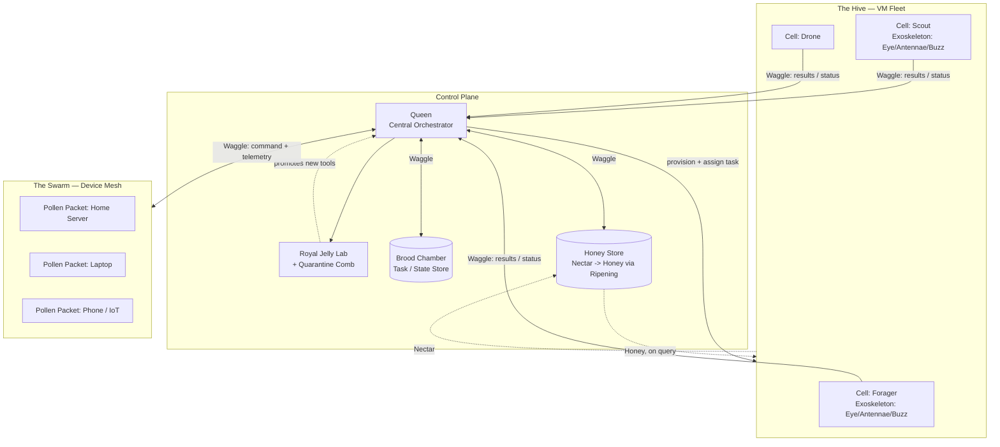

# HiveMind

**A super-agent orchestrator that provisions its own infrastructure, spins up virtual machines with full virtual peripherals, delegates work to subagents, builds its own tools, and reaches out to control any connected device from one central brain.**

> Status: early-stage / architecture & design phase. Nothing here is stable yet — this README describes the target system.

---

## Vision

Most agent frameworks run a single model in a single process against a fixed toolset. HiveMind is designed to be the layer above that: a **Queen** — a central orchestrating agent — that can, on its own initiative:

- Provision isolated **Cells** (virtual machines) on demand and hand each one to a **Worker**.
- Equip those Cells with an **Exoskeleton** — a virtual monitor, keyboard, mouse, and speakers — so Workers can drive full desktop/browser sessions the same way a human would, invisibly and in parallel.
- **Write, test, and register new tools for itself** via the Royal Jelly Lab instead of being limited to a fixed toolbelt.
- **Connect out to arbitrary devices** (servers, laptops, phones, IoT endpoints) through the Swarm, turning them into extensions of the Hive.
- Coordinate all of the above as one coherent system rather than a pile of scripts.

The end goal is a self-extending, self-orchestrating agent swarm that can be pointed at a broad goal and figure out what compute, tools, and endpoints it needs to get there.

---

## Terminology

The system borrows its vocabulary from real bee biology and beekeeping — it reads better than generic infra terms and every name maps to an actual behavior.

| Term | Meaning |
|---|---|
| **Queen** | The central orchestrator — the only component with a global view of the system |
| **The Hive** | The on-demand VM fleet |
| **Cell** | A single VM inside the Hive |
| **Worker** (Worker Bee) | A subagent bound to one Cell or external device |
| **Forager** | A Worker specialized in outbound data gathering (scraping, search, monitoring) |
| **Scout** | A Worker specialized in recon/exploration of new targets |
| **Guard Bee** | A Worker specialized in security, access control, and monitoring |
| **Undertaker** | A Worker specialized in cleanup and teardown |
| **Drone** | A short-lived, general-purpose, fully expendable Worker |
| **House Bee** | A Worker that ripens raw Nectar into durable Honey in the knowledge store |
| **Exoskeleton** | The bundle of virtual peripherals a Worker is equipped with inside a Cell |
| **Compound Eye** | Virtual display / framebuffer |
| **Antennae** | Virtual keyboard & mouse (synthetic HID input) |
| **Buzz** | Virtual audio (speaker/mic) |
| **Royal Jelly Lab** | The Tool Forge — where new tools are authored, tested, and promoted |
| **Quarantine Comb** | The sandbox a new tool must pass through before promotion |
| **Brood Chamber** | The central task/state store |
| **Honey Store** | The persistent, indefinitely-growing knowledge base the Queen shares with Workers |
| **Nectar** | Raw, unprocessed findings a Worker brings back from a task |
| **Honey** | Distilled, indexed knowledge retrieved from the Honey Store on demand |
| **Ripening** | The process of turning Nectar into Honey (chunking, summarizing, embedding, indexing) |
| **Waggle** (Waggle Protocol) | The Queen ↔ Worker/Swarm communication protocol |
| **Hive Entrance** | The system's API gateway / entry point |
| **The Swarm** | The Device Mesh — external devices registered with the Queen |
| **Pollen Packet** | The lightweight connector installed on an external device |
| **Swarming** | Scaling up — spinning up more Cells/Workers |
| **Absconding** | Mass teardown/shutdown of the Hive |
| **Overwintering** | An idle/paused pool of Cells kept dormant rather than destroyed |
| **Requeening** | Recovering from a Queen failure / restoring orchestrator state |
| **Pheromone Trail** | The audit/log trail left by every action in the system |
| **Observation Hive** | The observability dashboard |
| **Hive Manifest** | A config/spec file |
| **Pollen** | External plugin/extension packages |
| **Brood** | A release/version (Brood 1.0, Brood 2.0, ...) |

---

## Core Concepts

### 1. The Queen (Central Orchestrator)
The single always-on brain of the system. It owns the task graph, decides when new compute is needed, assigns work to Workers, and is the only component with a global view of the Hive. It never does the "hands-on" work itself — it delegates.

### 2. The Hive (VM Fleet)
On-demand, disposable Cells that Workers run inside. Each Cell is:
- Isolated from the host and from other Cells (blast-radius containment).
- Provisioned with a defined spec (OS, resources, lifetime, network access).
- Torn down by an Undertaker automatically when its Worker's task completes, or sent into Overwintering if it might be needed again soon.

### 3. Workers (Subagents)
A Worker is a Queen-assigned agent bound to one Cell (or external device). It receives a scoped objective, has access to that Cell's Exoskeleton and tools, reports progress/results back to the Queen over Waggle, and is expendable — if it fails or stalls, the Queen can kill and respawn it. Workers specialize by role:
- **Forager** — gathers data from the outside world (scraping, search, monitoring).
- **Scout** — explores/evaluates new targets before committing real resources.
- **Guard Bee** — handles security, access control, and monitoring of other Workers.
- **Undertaker** — tears down finished Cells and cleans up dead state.
- **Drone** — a generic, disposable Worker for one-off tasks with no special role.
- **House Bee** — ripens raw Nectar into Honey and maintains the Honey Store.

### 4. Exoskeleton (Virtual Peripherals)
For tasks that need a real desktop session rather than a raw HTTP client — GUI automation, sites that fingerprint headless browsers, multi-step visual workflows — each Cell can equip a Worker with:
- **Compound Eye** — a real framebuffer the Worker's browser/apps render into, so it can take screenshots and reason visually.
- **Antennae** — synthetic keyboard & mouse input so interaction is indistinguishable from a human driving the machine.
- **Buzz** — virtual speaker/mic devices for tasks involving audio playback, capture, or voice-driven sites.

This lets a Worker run a completely normal-looking desktop/browser session with nobody at the keyboard.

### 5. Royal Jelly Lab (Tool Forge)
The mechanism by which the Queen (or a Worker) can **author a new tool, run it through the Quarantine Comb, and promote it into the shared toolset** other Workers can call — the same way royal jelly transforms an ordinary larva into something with new capabilities. This is what makes the system self-extending instead of capped at whatever tools it shipped with.

### 6. The Swarm (Device Mesh)
A **Pollen Packet** is a lightweight connector installed on an external device (a home server, a laptop, a phone, an IoT box) to register it with the Queen. Once registered, a device joins the Swarm as an addressable node the Queen can dispatch Workers or commands to — extending the Hive beyond Cells it spun up itself onto real, persistent hardware.

### 7. The Honey Store (Knowledge Base)
The Queen's long-term memory, and an information center every Worker can draw from — designed to accumulate indefinitely without ever being limited by a single agent's context window. It works in two tiers, mirroring how a real hive turns forage into food reserves:

- **Nectar** — raw, unprocessed findings a Worker brings back from a task (page contents, logs, task outcomes, a quirk it hit on some site).
- **Honey** — that same knowledge after a House Bee has **ripened** it: chunked, summarized, embedded, deduped, and indexed.

A Worker doesn't get handed the whole Honey Store — it queries it over Waggle and gets back just the Honey relevant to its current task, the same way retrieval-augmented generation pulls only the relevant chunks instead of stuffing everything into the prompt. That's the point: knowledge compounds across every task the Hive has ever run, but any one Worker's context stays small.

Implementation-wise this is intentionally lightweight rather than a heavyweight vector-DB deployment — the default plan is **SQLite** for structured metadata (plus full-text search) paired with a vector-search extension (e.g. `sqlite-vec`) for semantic lookup, so a single Hive can run its Honey Store as one file. A dedicated vector database is a reasonable swap-in for larger installs, but SQLite keeps a single Hive self-contained and easy to back up or move.

---

## Architecture (target)

---

## Example Workflow

1. The Queen receives a high-level goal (e.g., "monitor these 20 sites and alert me when X changes").
2. She decomposes it into subtasks and decides she needs 5 parallel browser sessions.
3. She provisions 5 Cells, each equipped with a Compound Eye + Antennae, and assigns a Forager to each — first checking the Honey Store for any Honey already known about these sites, so nobody re-discovers what the Hive already learned last time.
4. A Forager hits a site that needs a capability the Hive doesn't have yet. It requests a new tool.
5. The Royal Jelly Lab scaffolds the tool, runs it through the Quarantine Comb, and promotes it.
6. Every Worker can now use the new tool. Results stream back to the Queen over Waggle and land in the Brood Chamber; raw Nectar from each Forager is handed to a House Bee, which ripens it into Honey for future tasks; every step is written to the Pheromone Trail.
7. The Queen sends Undertakers to tear down finished Cells (or Overwinters ones likely to be reused) and reports back.

---

## Design Principles

- **Disposable compute** — Cells and Workers are cheap to create and kill; nothing is precious except the Queen's state.
- **Least privilege by default** — a Worker gets only the network/tool/device access its task requires, enforced at the Hive Entrance by Guard Bees.
- **Everything is observable** — every Cell spin-up, tool creation, and Swarm command is written to the Pheromone Trail and visible in the Observation Hive.
- **Self-extension is sandboxed** — the Royal Jelly Lab never promotes a tool straight to production use without a Quarantine Comb pass first.
- **Knowledge outlives context** — anything a Worker learns gets ripened into the Honey Store instead of vanishing when its Cell is torn down, so the Hive's knowledge compounds indefinitely without bloating any one Worker's context window.
- **The Queen delegates, she doesn't do** — keeps the orchestrator simple and lets Worker logic evolve independently.

---

## Responsible Use

HiveMind is capable of remote device control, GUI automation that mimics human input, and autonomous tool creation — all of which are dual-use. This project is intended for:
- Automating your **own** infrastructure and accounts.
- Authorized testing, research, and personal productivity.

It is explicitly **not** intended for unauthorized access to systems you don't own or operate, evading detection/anti-bot measures on services where that violates terms of use, or mass/unattended action against third parties. Build and run responsibly.

---

## Roadmap

- [ ] Define the Waggle protocol (Queen ↔ Worker/Swarm message bus / RPC choice)
- [ ] Cell provisioning backend (local hypervisor first, cloud providers later)
- [ ] Exoskeleton layer: Compound Eye / Antennae / Buzz for Cells
- [ ] Royal Jelly Lab: sandboxed tool authoring, Quarantine Comb, and registration pipeline
- [ ] Swarm connector (Pollen Packet) for external devices
- [ ] Honey Store: RAG-backed knowledge base (SQLite + vector-search extension) with a Ripening pipeline for House Bees
- [ ] Brood Chamber (task/state store) + Observation Hive (dashboard)
- [ ] Auth & permission model (Guard Bee roles) across Queen, Workers, and Swarm

---

## Getting Started

This project is in the design phase — implementation hasn't started yet. This section will cover setup, dependencies, and standing up your first Hive (likely via a `hive` CLI) once the Queen and Cell provisioning backend land.

---

## License

TBD.
