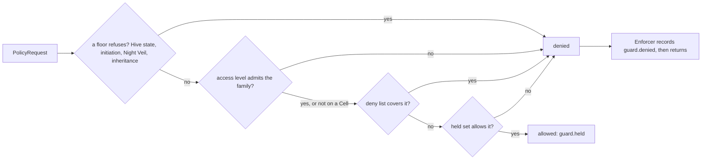

# hivemind.guard

The Guard is the Hive's capability model and policy engine (ADR-0039). Every action is authorised
against an explicit capability: one thing a principal (the operator, the Queen, a Warden, a
Worker, a Swarm device or an enrolled client device) may do, written `family` or `family:scope`.
Sets only narrow down the tree, and "why was this refused" is always a trail row with a rule and a
reason. The security tier enums themselves (`AccessLevel`, `CombShieldLevel`, `HoneyClearance`)
live in `cell/tiers.py`; the Guard interprets them.

Everything here is pure except `enforcer.py`, the one effectful module: it records each refusal
on the Pheromone Trail. The policy loader reads its TOML once, when a composition root builds it.

## Public API (roadmap steps 10.1, 10.2, 10.3, 10.3a-d, 10.6b and 10.7)

- **Capabilities** (`hivemind.guard.capabilities`, a package since 10.1): `CapabilityFamily`
  (every family in ADR-0039's table; phase 3's seven keep their values), `ScopeKind` (`FLAG`,
  `GLOB`, `PREFIX`, `HOST`, `ENUMERATED`, `ORDERED`, `AMOUNT`) and `FAMILIES_BY_KIND`;
  `Capability` (`parse` tries the longest family name first, so `tool:request` and
  `tool:scope:cell` are their own families; a flag is its bare name; every accepted string
  round-trips; direct construction validates the same grammar) with `matches(needed)` per kind:
  glob `fnmatch` over POSIX paths, prefix with a trailing `*`, host (`net`: an exact name, `*`,
  `*.domain` on a label boundary, an IP literal or a CIDR network; no other wildcard), enumerated
  (`llm`, `cell:comb_shield`, `tactic`, or `*`), ordered (`honey:clearance:c0 < c1 < c2`) and
  amount (`spend`, `*` unlimited). `CapabilitySet` with `parse`, `empty`, `allows`, `attenuate`
  (raises `CapabilityWideningError` rather than widening), `issubset` and `as_strings`; there is
  no union. `glob_literal` escapes a path before it is embedded in a glob scope (a scratch or
  keep root holding `*`, `?` or `[` would otherwise widen the grant to every sibling it matches),
  and a held glob scope always covers an identical needed one.
- **Access** (`hivemind.guard.access`): `CELL_EFFECT_FAMILIES` (the families that act on the
  machine: `fs:*`, `exec`, `net`, `device`, `cell:outside_scratch`, `exoskeleton*`, `geo`,
  `wifi:scan`, `host:metadata`), `governs`, `ceiling_for(level, scratch_root)`, `admits(level,
  family)` and `cap_to_access(requested, level, scratch_root)`, which keeps every ungoverned
  capability and each governed one the level's ceiling allows. Roadmap 10.1/10.7 changed phase
  3's ceilings: `tool` and `spend` are in none of them any more, because neither is an effect on
  the Cell.
- **Watch** (`hivemind.guard.watch`, roadmap 10.7): `WatchObservation`, `WATCH_OBSERVATIONS` and
  `watch_permits(level, observation)`: watch mode observes the process list, resource use, and
  logs and file-change events under the roots it may read, at every level exactly what
  `READ_ONLY` allows, and never the screen or the input (a separate, explicit grant).
- **Reports** (`hivemind.guard.report`, roadmap 10.6 and 10.6a, ADR-0043): `GuardReport` is one
  Guard Bee finding (the rule that fired, the trail events it cites, the Cell, bees, tasks and
  grants it touches, the recommended `GuardAction` and a `GuardConfidence`), ids and counts only.
  Only `REQUEST_ACTIONS` (isolate a Cell, quarantine a bee, Sting Cut) ask the Queen for anything,
  and they reach her through `GuardRequestDoor.file_guard_request`, the one seam between the
  Guard Bee and the Queen's inbox; the Guard Bee narrows the whole Hive alone. A report at
  CRITICAL confidence reaches the human whatever it recommends: `GuardRequestDoor.report_to_human`
  shows it as a SECURITY Alarm naming the report id, pushed to every device, durable before it
  returns and shown at most once per report id (a CRITICAL request is shown once, by the Queen's
  decision on it, which says what she did).
- **Scanner** (`hivemind.guard.scanner`, roadmap 10.6b, ADR-0043, `docs/guard/untrusted-content.md`):
  the deterministic, model-free untrusted-content scanner. `load_scan_patterns` reads
  `defaults/untrusted-content.toml` (six weighted families; every repetition bounded; each
  family's `examples` must fire it); `score_text` is pure (input bounded to `max_scan_chars`,
  NFKC-normalised, zero-width characters removed); `decide`/`thresholds_for` map a score to
  PASS, LABEL or DROP per Comb Shield tier; `ContentScanner.scan(text, ScanSite)` is the one
  effectful edge, recording a flag as `guard.injection_suspected` (source, consuming bee, tier,
  score, families and an HMAC-SHA256 digest under `SCANNER_KEY_NAME` in the secret store, never
  the text) before returning its `ScanVerdict`. A flag never stops a bee; `hivemind.memory.
  render_untrusted` applies the verdict.
- **Policy** (`hivemind.guard.policy`): `GuardPolicy` (each role's default set with `{scratch}`
  left to fill, the hive-wide deny list, the escalation table), `load_guard_policy(path,
  section)` (the shipped `defaults/policy.toml` or an operator's file, with the manifest's
  `[guard]` applied on top; refuses an unknown role, point or action, or an entry that is not a
  capability, with `GuardPolicyError`), `EnforcementPoint` (every point ADR-0039 names; step 10.3
  wires them), the request and decision models (`PrincipalKind`, `PrincipalRef`,
  `PolicyContext`, `PolicyRequest`, `EscalationAction`, `PolicyDecision`), the pure `evaluate`
  and `refusal` (a point's own out-of-reach refusal, rule `guard.scope.<scope>`), `role_set`,
  `warden_set`, `proposed_set`, `worker_role_name`, `QUEEN_ROLE`/`WARDEN_ROLE`, and (step 10.3)
  `queen_principal`, `warden_principal`, `worker_principal` and the classification catalogue
  (`AUTHORISED_AT`, `NOT_ACTIONS`, `PENDING_POINTS`, `classify`).
- **Floors** (`hivemind.guard.policy.floors`, roadmap steps 10.3a-d and ADR-0041): pure
  functions `evaluate` runs before anything else, each refusing under its own rule id whatever
  the held set says (see "Floors" below); `floor_decision(request, policy)` runs them alone.
  `GuardPolicy.hive_state` is a `HiveState` (the Hive's own state files and directories, kept in
  `comparable_path` form, and the Hive Stand's own addresses), set by a composition root.
  `PolicyContext` gained the facts floors read, each "absent means not applicable":
  `binding_local`, `control_link` (`ControlLink`), `resolved_addresses` and `goal_request`
  (`GoalRequestFacts`), beside `comb_shield`, `bound_tier` and `origin`.
- **Addresses** (`hivemind.guard.net`, a package so `workers` and `entrance` can share it without
  importing each other): `LOCALHOST`, `METADATA_HOST_NAMES`, `METADATA_ADDRESSES`, `IPAddress`,
  `IPNetwork`, `plain_address` (IPv4-mapped forms reduced), `normalise_host` (a zone id dropped
  only from an IPv6 literal), `ip_literal`, `is_loopback_name`, `address_refusal`,
  `network_refusal`, `is_metadata_address`, `is_metadata_host`; `Resolver`, `system_resolver`,
  `resolve_host` (bounded by `RESOLVE_TIMEOUT_S`, raising `UnresolvableHostError`) and the
  `FakeResolver` tests resolve through.
- **Enforcer** (`hivemind.guard.enforcer`): `Enforcer.check(request)` calls `evaluate` and, on a
  denial, records `guard.denied` (principal, point, capability, rule, reason, escalation; never
  content) before returning the decision. It never raises on a denial. `Enforcer.refuse(request,
  scope, why)` records the same row for a refusal the point decided itself (a Warden asking to
  grow a grant it does not hold; a binding key no `[llm.slots]` row serves).
  `Enforcer.check_floors(request)` runs the floors alone and records a refusal the same way, for
  a point whose held set another rule checks (the Capping gate's `exec` and `fs:write`) or whose
  principal acts with no set of its own (the operator's goal at placement and egress).
- **Errors** (`hivemind.guard.errors`): `GuardError` (root), `InvalidCapabilityError`,
  `CapabilityWideningError`, `GuardPolicyError`, `UnresolvableHostError`.

## How a decision is made



Only holding the capability turns a request into an allow. A Warden's own set is
`warden_set(policy, access_level, scratch_root)`: the `warden` role default, narrowed to the
lease's access level, less the deny list. A Worker's is its role default (`role_set`) plus what
its task needs, kept only where its Warden's set allows (`hivemind.workers.capabilities`).

## Floors (roadmap steps 10.3a-d, ADR-0039 and ADR-0041)

Floors hold whatever a set says: each reads the request's context and the policy's data, never
the shape of the held set, and only ever refuses. They run in this order, the first refusal
deciding (`floors/chain.py`):

| Floor | Rule | Refuses | Reads |
| --- | --- | --- | --- |
| Hive state (`floors/hive_state.py`) | `guard.state_floor.state_paths` | a bee's `fs:read`/`fs:write` on the `[hive] db` and its `-wal`/`-shm`/`-journal` siblings, the `[hive] secrets_dir` and everything under it, or the manifest (a write also on any directory above them) | `GuardPolicy.hive_state` |
| | `guard.state_floor.entry_points` | a bee's `exec` of `hive` or `hivemind-*` (argv[0]'s basename, `.exe` and the like stripped) | the need alone |
| | `guard.state_floor.loopback` | a bee's `net` to a loopback, unspecified or link-local host (every spelling: `localhost`, `*.localhost`, `127.0.0.0/8`, `::1`, `0.0.0.0/8`, `::`, IPv4-mapped forms), to one of the Hive Stand's own addresses or names (a Cell's host-gateway alias, a Night Veil Cell's onion service; a `*.domain` scope covering one), or to any address the name resolved to | `hive_state.own_addresses`, `hive_state.own_host_names`, `resolved_addresses` |
| Initiation (`floors/initiation.py`) | `guard.tier_floor.night_veil_initiation` | Night Veil placement or egress unless the task's origin is HUMAN and its durable goal request (origin HUMAN) named NIGHT_VEIL | `origin`, `goal_request` |
| Night Veil (`floors/night_veil.py`) | `guard.tier_floor.night_veil_virtual_only` | `cell:hive_stand` or `cell:real:*` for a Night Veil task | the need alone |
| | `guard.tier_floor.night_veil_local_slots` | an `llm` binding not shown local (in process, or served on the Cell itself; unknown fails closed) | `binding_local` |
| | `guard.tier_floor.night_veil_clearance` | Honey above `c1` (the `honey_access` point is pending until phase 7; the floor is tested through `evaluate`) | the need alone |
| | `guard.tier_floor.night_veil_location` | `geo`, `wifi:scan`, `host:metadata`, and `net` to a cloud metadata endpoint by name or resolved address | the need, `resolved_addresses` |
| | `guard.tier_floor.night_veil_control_link` | a Night Veil Cell's control link that is not a v3 onion service (`waggle.uris.is_onion_service_host`, the rule the Cell's transport dials by) through a `socks5h`/`socks4a` proxy on the Cell's loopback | `control_link` |
| Inheritance (`floors/inheritance.py`) | `guard.tier_floor.tier_inheritance` | activating egress for a tier weaker than the one the task is bound to | `bound_tier` |

"Under Night Veil" means the Cell's tier, or the task's bound or requested tier, is NIGHT_VEIL.
The bees are the Warden and Worker principals; the Queen, the operator and client devices never
meet the Hive-state floor. Where each fact comes from: the Queen's dispatcher adds the goal
request and the configured control link (`queen.dispatcher.night_veil`), binding locality is
stated by `queen.dispatcher.grants` and `wardens.spawn.binding`, a task's bound tier is
`Task.bound_tier` (set by `chamber.assign`), and the HTTP tool resolves the host and states every
address before it pins the request to one of them (`workers.tools.http`). The control link itself
is handed to a Night Veil Cell at provisioning (`hive.backends.bootstrap.cell_endpoint`), which
refuses a Night Veil Cell on a Hive with no hidden service configured.

## Enforcement points (roadmap step 10.3)

Every state-changing action that exists today passes its point through an `Enforcer` before it
happens. The composition roots build one: `hivemind.cli.compose.guard.build_enforcer` (the Queen
and the Hive Stand's Warden share it, over `[guard]`'s policy with the Hive's own state named on
it: the resolved database and secrets directory, the manifest, and this machine's interface
addresses) and `hivemind.cli.in_cell.deps` (a Virtual Cell's Warden, over the shipped policy
naming the Hive Stand's address when the Cell's Queen URL spells one, recording to that Cell's
own trail segment).

| Point | Principal | Needs | Where |
| --- | --- | --- | --- |
| `placement` | the Queen, for the goal | `cell:hive_stand`, `cell:real:<cell>`, `cell:virtual`, `cell:comb_shield:<tier>`; a Night Veil task's floors first; a Night Veil goal's location asks at submission | `queen.placement` rules; `queen.dispatcher.ready` and `.night_veil`; `queen.goal_submission` |
| `lease_creation` | the Warden | its Cell's lease capability (`WardenDeps.lease_capability`) | `wardens.ticks.lease` |
| `grant_issue` | the Queen | `llm:<slot>` per binding, in the Warden's set and the goal's, with its locality stated | `queen.dispatcher.grants` |
| `forage_request` | the Warden | `forage:request`, and holding the grant | `queen.ticks.forage` |
| `warden_spawn` | the Queen | `warden:spawn` | `queen.attach` |
| `tool_invocation` | the Worker | `tool:<name>`; `net:<host>` for `http_request`, then every address it resolves to; `exec:<argv[0]>` against the floors; a Capping `exec`/`net` refusal | `workers.tools.registry`, `.http`, `.session`, `.proposals` |
| `session_outside_scratch` | the Worker | `fs:read:<path>`; a write also `cell:outside_scratch:<path>`, and `fs:write:<path>` against the floors | `workers.tools.session`, `.keep`, `.proposals` |
| `slot_binding` | the Warden, or the Queen for her `Intervene(REBIND)` | `llm:<slot>` in the grant and the sub-bee's set, bound to the Cell's tier with the chain's locality stated | `wardens.spawn.binding` |
| `question_routing` | the Worker at the Warden, the Warden at the Queen | `question:human` | `workers.tools.ask`, `wardens.ticks.questions`, `queen.questions` |
| `comb_shield_egress` | the Queen, for the goal | `cell:comb_shield:<tier>`; the floors for every task, the operator's own included | `queen.dispatcher.acquire` |

A goal carries a ceiling: `TaskSpec.capabilities` (the submitter's set, `None` for the operator's
own local path) travels on every task and on Waggle 1.8's `task.assign`, so placement, grant
issue and the Warden's `worker_capabilities` all narrow to it. `policy/catalogue.py` classifies
every trail kind as authorised at a point or as no action (with the reason), and names the
points whose subsystem is not built (`PENDING_POINTS`); `tests/unit/guard/policy/test_catalogue.py`
fails on an unclassified or doubly classified kind, and holds the call-site registry that must
keep naming each built point.

## How to test this

```bash
uv run --frozen pytest packages/hivemind/tests/unit/guard
```

Coverage floor is 95% (codingrules section 14.1):

```bash
COVERAGE_FILE=.coverage.guard uv run --frozen pytest -p no:cacheprovider --cov=hivemind.guard \
    --cov-report=term-missing packages/hivemind/tests/unit/guard
```
