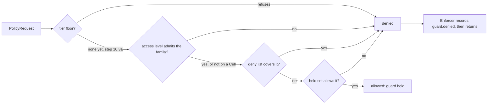

# hivemind.guard

The Guard is the Hive's capability model and policy engine (ADR-0031). Every action is authorised
against an explicit capability: one thing a principal (the operator, the Queen, a Warden, a
Worker, a Swarm device or an enrolled client device) may do, written `family` or `family:scope`.
Sets only narrow down the tree, and "why was this refused" is always a trail row with a rule and a
reason. The security tier enums themselves (`AccessLevel`, `CombShieldLevel`, `HoneyClearance`)
live in `cell/tiers.py`; the Guard interprets them.

Everything here is pure except `enforcer.py`, the one effectful module: it records each refusal
on the Pheromone Trail. The policy loader reads its TOML once, when a composition root builds it.

## Public API (roadmap steps 10.1, 10.2, 10.3 and the data half of 10.7)

- **Capabilities** (`hivemind.guard.capabilities`, a package since 10.1): `CapabilityFamily`
  (every family in ADR-0031's table; phase 3's seven keep their values), `ScopeKind` (`FLAG`,
  `GLOB`, `PREFIX`, `HOST`, `ENUMERATED`, `ORDERED`, `AMOUNT`) and `FAMILIES_BY_KIND`;
  `Capability` (`parse` tries the longest family name first, so `tool:request` and
  `tool:scope:cell` are their own families; a flag is its bare name; every accepted string
  round-trips; direct construction validates the same grammar) with `matches(needed)` per kind:
  glob `fnmatch` over POSIX paths, prefix with a trailing `*`, host (`net`: an exact name, `*`,
  `*.domain` on a label boundary, an IP literal or a CIDR network; no other wildcard), enumerated
  (`llm`, `cell:comb_shield`, `tactic`, or `*`), ordered (`honey:clearance:c0 < c1 < c2`) and
  amount (`spend`, `*` unlimited). `CapabilitySet` with `parse`, `empty`, `allows`, `attenuate`
  (raises `CapabilityWideningError` rather than widening), `issubset` and `as_strings`; there is
  no union.
- **Access** (`hivemind.guard.access`): `CELL_EFFECT_FAMILIES` (the families that act on the
  machine: `fs:*`, `exec`, `net`, `device`, `cell:outside_scratch`, `exoskeleton*`, `geo`,
  `wifi:scan`, `host:metadata`), `governs`, `ceiling_for(level, scratch_root)`, `admits(level,
  family)` and `cap_to_access(requested, level, scratch_root)`, which keeps every ungoverned
  capability and each governed one the level's ceiling allows. Roadmap 10.1/10.7 changed phase
  3's ceilings: `tool` and `spend` are in none of them any more, because neither is an effect on
  the Cell. Watch mode's bound (what `READ_ONLY` lets it observe) is documented in the module.
- **Policy** (`hivemind.guard.policy`): `GuardPolicy` (each role's default set with `{scratch}`
  left to fill, the hive-wide deny list, the escalation table), `load_guard_policy(path,
  section)` (the shipped `defaults/policy.toml` or an operator's file, with the manifest's
  `[guard]` applied on top; refuses an unknown role, point or action, or an entry that is not a
  capability, with `GuardPolicyError`), `EnforcementPoint` (every point ADR-0031 names; step 10.3
  wires them), the request and decision models (`PrincipalKind`, `PrincipalRef`,
  `PolicyContext`, `PolicyRequest`, `EscalationAction`, `PolicyDecision`), the pure `evaluate`
  and `refusal` (a point's own out-of-reach refusal, rule `guard.scope.<scope>`), `role_set`,
  `warden_set`, `proposed_set`, `worker_role_name`, `QUEEN_ROLE`/`WARDEN_ROLE`, and (step 10.3)
  `queen_principal`, `warden_principal`, `worker_principal` and the classification catalogue
  (`AUTHORISED_AT`, `NOT_ACTIONS`, `PENDING_POINTS`, `classify`).
- **Enforcer** (`hivemind.guard.enforcer`): `Enforcer.check(request)` calls `evaluate` and, on a
  denial, records `guard.denied` (principal, point, capability, rule, reason, escalation; never
  content) before returning the decision. It never raises on a denial. `Enforcer.refuse(request,
  scope, why)` records the same row for a refusal the point decided itself (a Warden asking to
  grow a grant it does not hold; a binding key no `[llm.slots]` row serves).
- **Errors** (`hivemind.guard.errors`): `GuardError` (root), `InvalidCapabilityError`,
  `CapabilityWideningError`, `GuardPolicyError`.

## How a decision is made



Only holding the capability turns a request into an allow. A Warden's own set is
`warden_set(policy, access_level, scratch_root)`: the `warden` role default, narrowed to the
lease's access level, less the deny list. A Worker's is its role default (`role_set`) plus what
its task needs, kept only where its Warden's set allows (`hivemind.workers.capabilities`).

## Enforcement points (roadmap step 10.3)

Every state-changing action that exists today passes its point through an `Enforcer` before it
happens. The composition roots build one: `hivemind.cli.compose.deps.build_enforcer` (the Queen
and the Hive Stand's Warden share it, over `[guard]`'s policy) and `hivemind.cli.in_cell.deps`
(a Virtual Cell's Warden, over the shipped policy, recording to that Cell's own trail segment).

| Point | Principal | Needs | Where |
| --- | --- | --- | --- |
| `placement` | the Queen, for the goal | `cell:hive_stand`, `cell:real:<cell>`, `cell:virtual`, `cell:comb_shield:<tier>` | `queen.placement` rules; `queen.dispatcher.ready` records the refusal |
| `lease_creation` | the Warden | its Cell's lease capability (`WardenDeps.lease_capability`) | `wardens.ticks.lease` |
| `grant_issue` | the Queen | `llm:<slot>` per binding, in the Warden's set and the goal's | `queen.dispatcher.grants` |
| `forage_request` | the Warden | `forage:request`, and holding the grant | `queen.ticks.forage` |
| `warden_spawn` | the Queen | `warden:spawn` | `queen.attach` |
| `tool_invocation` | the Worker | `tool:<name>`; `net:<host>` for `http_request`; a Capping `exec`/`net` refusal | `workers.tools.registry`, `.http`, `.proposals` |
| `session_outside_scratch` | the Worker | `fs:read:<path>`; a write also `cell:outside_scratch:<path>` | `workers.tools.session`, `.proposals` |
| `slot_binding` | the Warden, or the Queen for her `Intervene(REBIND)` | `llm:<slot>` in the grant and the sub-bee's set | `wardens.spawn.binding` |
| `question_routing` | the Worker at the Warden, the Warden at the Queen | `question:human` | `workers.tools.ask`, `wardens.ticks.questions`, `queen.questions` |
| `comb_shield_egress` | the Queen, for the goal | `cell:comb_shield:<tier>` | `queen.dispatcher.acquire` |

A goal carries a ceiling: `TaskSpec.capabilities` (the submitter's set, `None` for the operator's
own local path) travels on every task and on Waggle 1.6's `task.assign`, so placement, grant
issue and the Warden's `worker_capabilities` all narrow to it. `policy/catalogue.py` classifies
every trail kind as authorised at a point or as no action (with the reason), and names the
points whose subsystem is not built (`PENDING_POINTS`); `tests/unit/guard/policy/test_catalogue.py`
fails on an unclassified or doubly classified kind, and holds the call-site registry that must
keep naming each built point.

## How to test this

```bash
uv run --frozen pytest packages/hivemind/tests/unit/guard
```

Coverage floor is 95% (codingrules section 14.1):

```bash
COVERAGE_FILE=.coverage.guard uv run --frozen pytest -p no:cacheprovider --cov=hivemind.guard \
    --cov-report=term-missing packages/hivemind/tests/unit/guard
```
